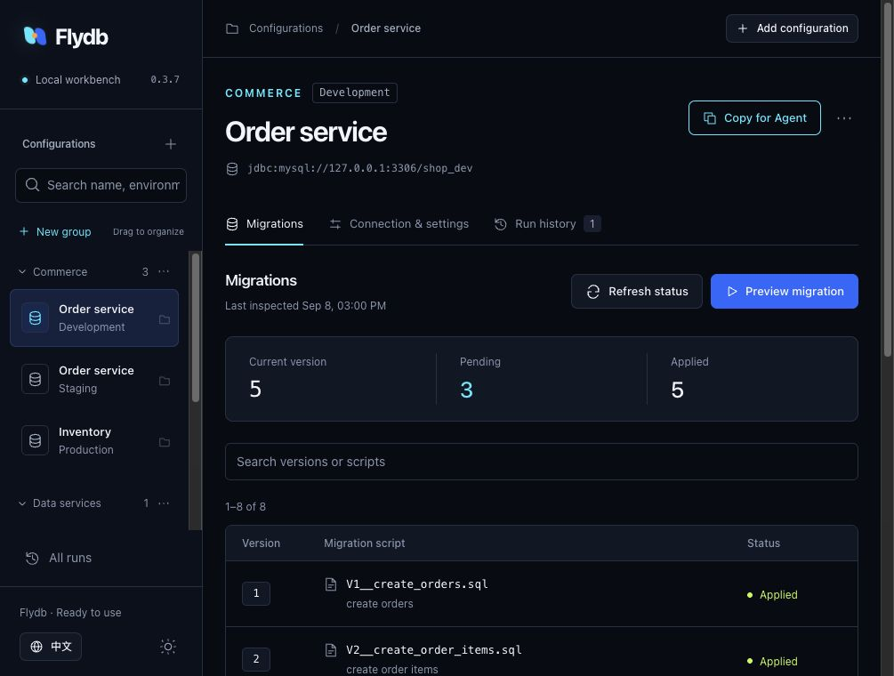

English | [中文](./README.md)

<p align="center">
  
</p>

# Flydb

**Database migrations you can see. Context your Agent can use.**

[](https://github.com/zzxCoding/Flydb/actions/workflows/ci.yml)
[](https://github.com/zzxCoding/Flydb/releases/latest)
[](./LICENSE)


[Website & demo](https://flydb.zzxcoding.dev) · [Download](https://github.com/zzxCoding/Flydb/releases/latest) · [GUI guide](./docs/getting-started/web.en.md) · [Agent setup](./flydb-skills/README.md) · [Documentation](./docs/getting-started/README.md)

Flydb helps developers and operators manage versioned database changes. Use the local GUI to organize configurations, review SQL and watch execution; use the CLI in scripts and CI; copy context to an Agent when you want help. All three entry points share the same configuration and migration engine, while the GUI and local CLI share execution records.

MySQL, PostgreSQL, Oracle and Chinese databases including OceanBase, TiDB, DM8, KingbaseES and openGauss. **Run with Java 8+; the GUI needs no Node.js, network access or language model.**


*Actual workbench UI using fictional demonstration configurations and migration records.*

## Choose how you work

| Your workflow | What Flydb provides |
|---|---|
| Manage development, staging and production configurations | Collapsible groups, drag-and-drop organization, forms and an advanced editor for the original files |
| Review an upgrade before applying it | SQL previews, version search, pagination, full-text search and complete SQL downloads |
| Follow execution and diagnose failures | Script progress, transaction outcomes and post-run verification; unknown outcomes stay explicit |
| Bring in an Agent | “Copy for Agent” packages redacted settings, migration state and recent errors; Skills, JSON and MCP offer further integration |
| Automate migrations in an application or pipeline | CLI for CI, a Java API and Spring Boot 2/3 starters sharing the same engine |

## Open the GUI with one command

Download the ZIP from [Releases](https://github.com/zzxCoding/Flydb/releases/latest), extract it and run:

```bash
cd flydb-cli-0.3.7
bin/flydb web
```

On Windows, use `bin\flydb.bat web`. Import an existing `flydb.conf` or create a configuration in the browser, then provide the JDBC driver for your database. No account setup; Chinese / English and light / dark themes are included. Starting the workbench does not run migrations.

Open an existing configuration directly:

```bash
bin/flydb --config /path/to/project/flydb.conf web
```

See the [GUI guide](./docs/getting-started/web.en.md). Vendor JDBC drivers are supplied by the user under their respective licenses, not bundled in the ZIP.

<details>
<summary><strong>Prefer a terminal? Start with the CLI</strong></summary>

For an existing MySQL database:

```bash
cp /path/to/mysql-connector-j.jar drivers/
bin/flydb init --url 'jdbc:mysql://127.0.0.1:3306/demo' --user flydb_user --database-type mysql --yes
export FLYDB_PASSWORD='replace-me'
bin/flydb validate
bin/flydb --dry-run migrate
# Review the SQL and target before applying
bin/flydb migrate
bin/flydb info
```

`init` generates `flydb.conf`, `db/migration/V1__init.sql` and `drivers/README.md`, refusing to overwrite existing files. The V1 sample contains `SELECT 1;`; replace it with your actual changes. Environment variables and password files are also supported.

</details>

## One migration engine across every entry point

- **Review before execution**: checksum validation, concurrency locks, transaction handling and failure blocking. Changes to configuration or scripts after a preview are rechecked.
- **Fit existing environments**: a Java 8 core with zero third-party runtime dependencies, a standalone CLI ZIP, and Spring Boot 2/3 starters.
- **Work across database families**: built-in dialects and driver loading, extensible through `DatabaseType` SPI. Verification levels are documented below.
- **Share facts with your Agent**: structured JSON, Plan Artifacts and execution records. Unknown or interrupted migrations are never automatically replayed. GUI clean requires risk acknowledgment and typing `CLEAN`.

Flydb manages migration workflow and database dialect behavior. It does not translate arbitrary vendor SQL into other database syntaxes; keep separate migration directories where dialects differ.

## Database support

| Database family | Built-in dialect | Current verification level |
|---|---:|---|
| MySQL  | Yes | Automated contract tests; CLI distribution end-to-end verification |
| PostgreSQL | Yes | Automated contract tests |
| Oracle | Yes | Automated contract tests; end-to-end validation (validate / clean / migrate) completed on a licensed real instance |
| DM8 (Dameng) | Yes | Dialect and driver-metadata contract tests; real-environment certification pending |
| KingbaseES | Yes | Dialect and driver-metadata contract tests; real-environment certification pending |
| openGauss | Yes | Dialect and driver-metadata contract tests; real-environment certification pending |
| OceanBase | Oracle/MySQL family reuse | Oracle tenant end-to-end validated on a licensed real instance; MySQL tenant under lightweight compatibility tests |
| TiDB | MySQL family reuse | Lightweight compatibility tests; real-environment coverage growing |
| Other JDBC databases | Extensible | Requires a JDBC driver and a `DatabaseType` SPI dialect |

See the [database getting-started guides](./docs/getting-started/README.md) for drivers, URLs, permissions, and known limitations per database. The status reflects current verification evidence, not vendor certification. The full matrix of modules, Java/Spring Boot versions, and database drivers is in the [compatibility matrix](./docs/reference/compatibility.md) (in Chinese). For vendor or Xinchuang JDBC databases, start with the [JDBC integration guide](./docs/getting-started/jdbc-integration.md).

## Roadmap

- [x] **Reliable migration runtime**: engine, 8 built-in dialects, CLI, Spring Boot starters, Agent Skill, the `v0.2.0` GitHub Release, and the `v0.2.1` Maven Central publishing
- [x] **DX and machine contract**: `--json` machine-readable output, protocolVersion contract versioning, CI integration docs, an Agent Plugins 1.0 package (`v0.3.0`; package managers and a Docker image on demand)
- [x] **Agent distribution**: an MCP adapter (TypeScript, nine domain tools, writes unregistered by default) plus the Plan Artifact v1 plan digest; a built adapter ships in the CLI ZIP
- [x] **Local workbench**: multiple configurations, groups, migration previews, execution records and Agent handoff
- [ ] **Brownfield change intelligence**: impact analysis, application reference scanning, coverage with explicit unknowns
- [ ] **Agent-safe change runtime**: a Plan → Validate → Risk → Approval → Apply → Verify protocol

The roadmap indicates direction, not delivery commitments; see [ROADMAP.md](./ROADMAP.md) (in Chinese) for details and product boundaries.

## Agent usage

For structure and code analysis, use the independently maintained [`flydb-analysis` Skill](flydb-skills/docs/flydb-analysis.md). This preview provides basic dialect prechecks, Schema snapshots and drift comparison, database dependencies, application references, and change impact analysis. It works with offline materials and projects without Flydb, and can be updated independently of the JARs.

If you are an agent, read the repository-root [`AGENTS.md`](./AGENTS.md) first, then install or enable the [`flydb-cli` Skill](./flydb-skills/skills/flydb-cli/SKILL.md) as it instructs before running commands; for migrations, run `validate` and `--dry-run migrate` first. The Skill is a thin orchestration layer that never duplicates the CLI manual; command, configuration, and error-code details are authoritative in [`docs/reference`](./docs/reference/README.md). The Skill follows the open `SKILL.md` format for reuse across Claude Code, Codex, Gemini CLI, ZCode, and other agents — see [`flydb-skills`](./flydb-skills/README.md). MCP-capable hosts can also call Flydb as MCP tools via [`mcp.json`](./flydb-skills/mcp.json) (write tools unregistered by default); see the [MCP tools reference](./docs/reference/mcp-tools.md) and the [setup guide](./docs/getting-started/mcp-adapter.md) (in Chinese).

The CLI distribution ZIP includes `AGENTS.md`, `docs/`, and `flydb-skills/`, so documentation and the Skill remain available with only the distribution and no source checkout. If you copy the Skill into an agent-specific directory, keep the distribution path so it can resolve those docs.

<details>
<summary>For human users: have your agent install and use the Flydb Skill</summary>

> I am using Flydb. Please read and follow [AGENTS.md](https://github.com/zzxCoding/Flydb/blob/main/AGENTS.md), then install or enable the `flydb-cli` Skill. After installation, confirm `bin/flydb version`; for migration tasks, run `validate` and `--dry-run migrate` first. Do not put passwords in commands, logs, or SQL, and do not run database-changing commands without my explicit authorization. Report the Skill installation path and the next step when done.

</details>

## Use in applications

Java API — `flydb-core` does not depend on any connection pool, logging framework, or JDBC driver; the caller manages the `DataSource`:

```java
Flydb flydb = Flydb.configure()
    .dataSource(dataSource)
    .databaseType("mysql") // explicit is recommended for family reuse or custom dialects
    .locations("classpath:db/migration")
    // .targetVersion("3")
    .load();

flydb.migrate();
```

Plain Java applications depend on `flydb-core`:

```xml
<dependency>
  <groupId>io.github.zzxcoding</groupId>
  <artifactId>flydb-core</artifactId>
  <version>0.3.7</version>
</dependency>
```

Spring Boot applications pick the matching starter; it runs `migrate` during context initialization and aborts startup on failure:

```xml
<!-- Spring Boot 3.x / Java 17+ -->
<dependency>
  <groupId>io.github.zzxcoding</groupId>
  <artifactId>flydb-spring-boot-3-starter</artifactId>
  <version>0.3.7</version>
</dependency>
<!-- Spring Boot 2.7 / Java 8 -->
<dependency>
  <groupId>io.github.zzxcoding</groupId>
  <artifactId>flydb-spring-boot-2-starter</artifactId>
  <version>0.3.7</version>
</dependency>
```

> The CLI is distributed through [GitHub Releases](https://github.com/zzxCoding/Flydb/releases). Starting with `v0.2.1`, all modules under the `io.github.zzxcoding` groupId are published to Maven Central (Java package names stay `com.flydb.*`); earlier releases must be built from source.

Java 8 applications use `flydb-spring-boot-2-starter` (Boot 2.7.18; [Spring states](https://spring.io/blog/2023/11/23/spring-boot-2-7-18-available-now/) that 2.7.18 is the last open-source release of the Boot 2.x line, so new projects should prefer the Boot 3 starter). The starter reuses the application's primary `DataSource` by default; set `flydb.url/user/password` to migrate with a separate DDL account, and `flydb.enabled=false` to disable auto-configuration entirely. Runnable examples: [Boot 2](./examples/boot2-demo), [Boot 3](./examples/boot3-demo); see the [Spring Boot starter design](./docs/design/07-spring-boot-starter.md).

## Names and configuration

```text
V1__create_user.sql       # versioned migration, applied successfully once
V1.1__add_status.sql      # dotted version
R__refresh_user_view.sql  # rerun when its checksum changes
U1__create_user.sql       # undo for the last applied V1
```

> **Naming change:** `R<version>__...sql` is rejected with `FLYDB-2005` and the check cannot be disabled. Use `U<version>__...sql` for undo scripts and versionless `R__...sql` for repeatable migrations.

- The default location is `filesystem:db/migration`, scanned recursively; the config generated by `init` uses an absolute path so runs are independent of the working directory.
- Configuration precedence is `CLI args > FLYDB_* environment variables > flydb.conf > built-in defaults`; config files are resolved from `--config`, the current directory, then the installation's `conf/`; unknown `flydb.*` keys fail with a near-miss suggestion.
- SQL supports `${key}` placeholders passed with `-Dkey=value`; undefined placeholders fail before execution with the script line number.
- Exit codes: `0` success, `1` general error, `2` validation failure, `3` lock conflict or timeout, `4` configuration error, `5` user interruption.

```bash
bin/flydb migrate --target-version 3
bin/flydb migrate --start-version 2 --end-version 5
bin/flydb validate
bin/flydb baseline --baseline-version 5
bin/flydb repair
bin/flydb undo
bin/flydb clean --clean-disabled=false --force   # clean is disabled by default; double opt-in for non-interactive use
```

Version families, directory versions, path glob/regex filtering, and directory-version ordering are explicitly enabled advanced rules; no filtering bypasses validation or `out-of-order` protection. See the [configuration reference](./docs/reference/configuration.md) (in Chinese) for full patterns and safety constraints, the [command reference](./docs/reference/commands.md), and the [error-code reference](./docs/reference/errors.md). For organizing automation across multiple databases and multiple test/production environments, see the [multi-environment guide](./docs/getting-started/multi-environment.md) (in Chinese).

## Build from source

The full reactor, including the Boot 3 modules, is built with Java 17; the Boot 2 starter, Boot 2 example, core, and CLI retain Java 8 bytecode. If your shell switches JDKs through a function, run `jdk17` first:

```bash
./mvnw verify
```

The CLI distribution is generated at `flydb-cli/target/flydb-cli-0.3.7.zip`. The core module enforces an 80% JaCoCo line-coverage gate and zero non-test runtime dependencies via Maven Enforcer.

Database integration contracts are skipped by default. Set `-Pmysql`/`-Ppostgresql` and `-Dflydb.integration.database=<dialect>` explicitly to start temporary databases and run the selected tests. The full matrix runs in `.github/workflows/ci.yml`.

<details>
<summary>Pre-release checks (stage 8)</summary>

```bash
./scripts/check-bytecode.sh 52 \
  flydb-core/target/classes flydb-cli/target/classes \
  flydb-spring-boot-2-starter/target/classes examples/boot2-demo/target/classes
./scripts/check-bytecode.sh 61 \
  flydb-spring-boot-3-starter/target/classes examples/boot3-demo/target/classes
./mvnw -DskipTests deploy \
  -DaltDeploymentRepository=local::file:./target/staging
./scripts/check-release-artifacts.sh target/staging flydb-cli/target
```

</details>

## Contributing

Issues and PRs are welcome. See the [contributing guide](./CONTRIBUTING.md) for the full workflow, and run `./mvnw -B verify` before submitting. Report vulnerabilities privately through the process in the [security policy](./SECURITY.md), not in a public issue. Start with the [design overview](./docs/design/00-overview.md) for architecture and design documents.

## License

[Apache-2.0](./LICENSE). Flydb is distributed under the Apache License 2.0; users obtain JDBC drivers separately and must comply with vendor licensing and distribution terms. Release packages include [`NOTICE`](./NOTICE).

## Local GUI

Version 0.3.5 adds `bin/flydb web`: original configuration files, migration preview and progress, shared CLI records, Chinese/English and light/dark themes. There are no accounts or roles. See the [GUI guide](docs/getting-started/web.en.md). Full source builds now also require Node.js 22.12+ and npm; extracted distributions only need Java 8+.
